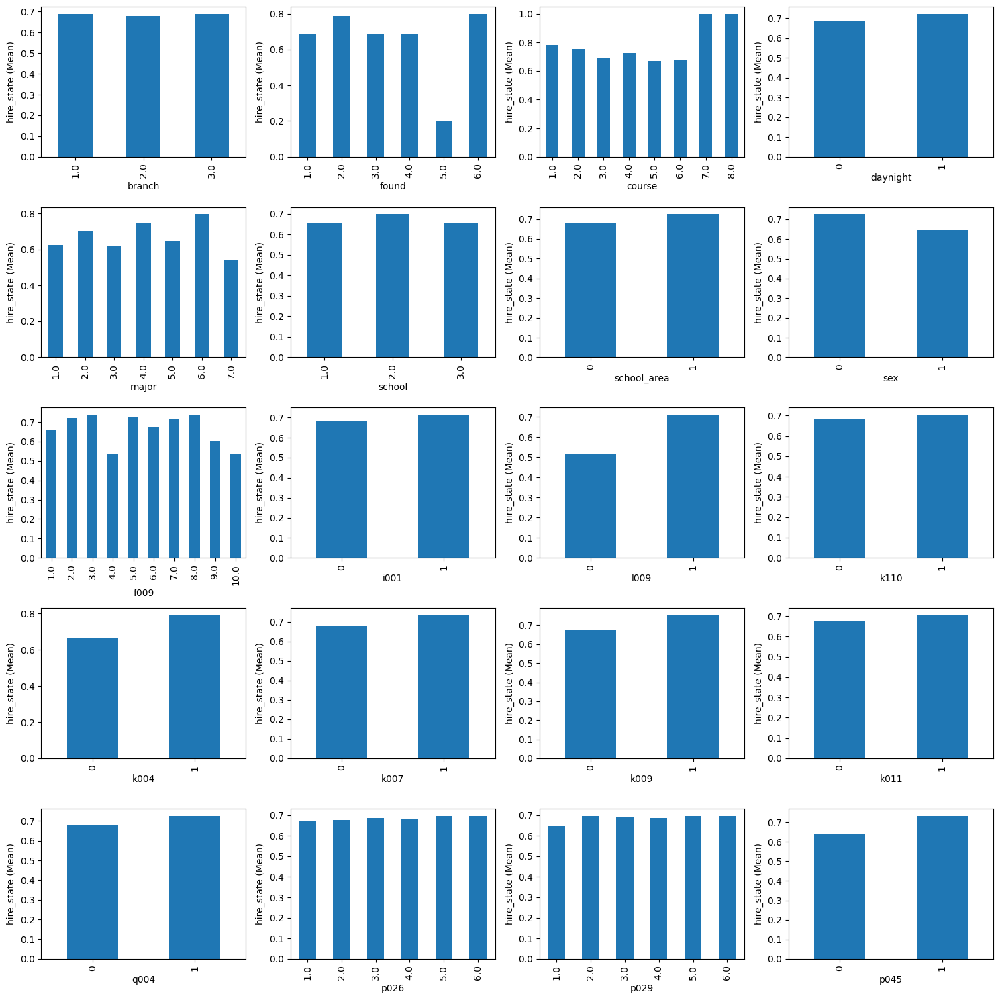
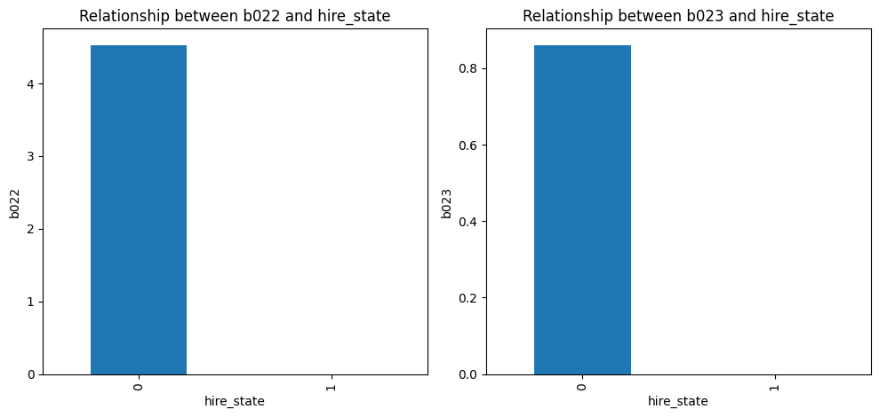
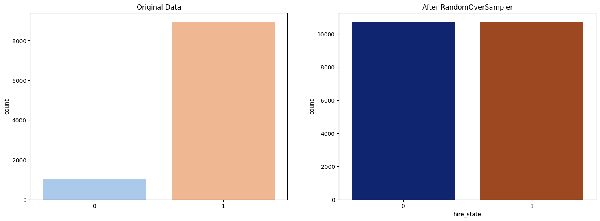
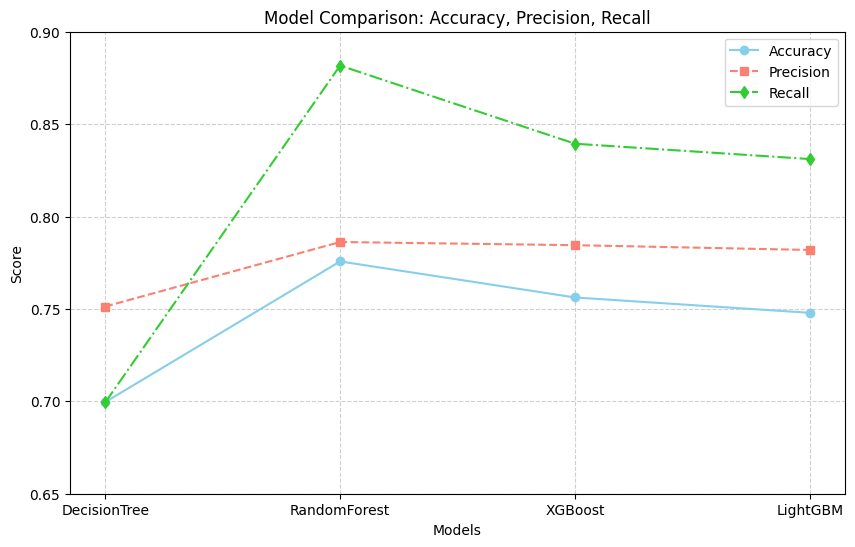

# [SKN09-ML-4Team]
✅ SKN AI FAMILY CAMP 9기<br>
✅ 개발 기간: 2025.01.25 - 2025.02.02

<br>

# 📍 팀 소개
### 👩‍👧‍👦팀명: 자비스(JOBIS)<br>

### 👩‍💻팀원
 
| 김우중👨‍💻 | 임수연👩‍💻 | 조민훈👨‍💻 |
|--|--|--|
|<a href="https://github.com/kwj9942">@kwj9942</a>|<a href="https://github.com/ohback">@ohback</a>|<a href="https://github.com/alche22">@alche22</a>|
<br>

# 📍 프로젝트 개요
### [ 주제 ]<br>
취업 훈련을 받은 대졸자의 취업 현황 예측

### [ 배경 ]<br>
청년들의 취업률이 지속적으로 감소하는 추세에, 취업에 도움이 되는 정보를 제공하기 위하여 한국고용정보원 고용통계조사팀에서 시행한 설문조사의 응답을 분석하고 머신러닝을 활용하여 취업 가능성을 예측함으로써 효과적인 취업 전략 수립을 위한 프로그램을 제작


<br>

</br>

# 📍 데이터셋 개요 & 데이터 시각화
### [ 데이터셋 개요 ]<br>
학교에서 노동시장으로의 학교 (전공)별 이행현황 분석과 원활한 이행을 지원하기 위한 다각적인 정책적 수요 증대 조사인 [대졸자직업이동경로조사(GOMS: Graduates Occupational Mobility Survey)] 4년치(2016-19년도) 데이터를 사용<br>
출처: [https://survey.keis.or.kr/index.jsp](https://survey.keis.or.kr/index.jsp)
<br>
</br>

### [ 데이터 시각화 ]<br>
- Heatmap<br>


<br>
</br>

- Bar plot<br>



<br>
</br>

- Box plot<br>


<br>
</br>

# 📍 데이터 전처리
1) 18년도의 자격증 점수 관련 응답에 문자와 숫자가 혼합되어 다른 연도와 응답코드 통일을 위해 문자를 삭제하고, 모든 연도의 결측값을 0으로 채움
```python
# 토익 점수 없으면 0, 18년도 문자형 변수 변경
use_data['i033'] = use_data['i033'].fillna(0)
use_data['i033'] = use_data['i033'].apply(lambda x: int(str(x)[2:-1]) if str(x)[0:1] == 'b' else int(x))
```
<br>

2) 응답코드가 세분화된 범주형 데이터의 경우 설문조사지와 비교하여 0과 1로 간소화
```python
# 군 복무 경험 있으면 1, 없으면 0
use_data['p045'] = use_data['p045'].replace({val:0 for val in [-1,1,6,7]})
use_data['p045'] = use_data['p045'].apply(lambda x: 0 if x == 0 else 1)
use_data['p045'] = use_data['p045'].fillna(0)
```
<br>

3) 고용여부와 상관관계를 보이지 않는 b코드 제거



<br>

4) 유의미한 변수들과 취업률의 상관관계
- 직업/교육 훈련 종료 여부: 훈련을 끝까지 마친 응답자의 취업률이 약 20% 높음


<br>

- 고등학교 계열: 3번(외고, 과학고, 국제고), 8번(특성화고)의 취업률이 높고,<br>
4번(예술고, 체육고), 10번(방통고, 대안학교 등)의 취업률이 낮음


<br>

- 전공: 의약, 공학, 사회 계열 순으로 취업률이 높고 예체능 계열의 취업률이 가장 낮음


<br>
</br>

# 📍 머신 러닝 사용 모델 & 단계별 성능 향상


## 1) 기본 모델<br>
기본값으로 `DecisionTree, RandomForest, XGBoost` 3가지 모델을 시도<br> -> `RandomForest`의 Train set을 제외하고 모두 0.7 정도의 정확도를 보임


<br>

## 2) 평가 : 혼동행렬<br>
**혼동행렬** 확인 결과, 대부분 1(취직함)으로 분류됨 <br>
  -> 70% 대의 성능이 나오는 이유는 전부 y=1(취직함)으로 예측하기 때문으로 y값의 비율 차이로 잘못 예측한 것이라 추정 <br>


<h3>[ 모델 성능 비교 ]</h3>
<table border="1" style="font-size:1.2em; width:100%;">
  <thead>
    <tr>
      <th>모델</th>
      <th>정확도 (Accuracy)</th>
      <th>정밀도 (Precision)</th>
      <th>재현율 (Recall)</th>
    </tr>
  </thead>
  <tbody>
    <tr>
      <td><strong>DecisionTree</strong></td>
      <td>0.6996</td>
      <td>0.7247</td>
      <td>0.8977</td>
    </tr>
    <tr>
      <td><strong>RandomForest</strong></td>
      <td>0.7740</td>
      <td>0.7317</td>
      <td>0.9306</td>
    </tr>
    <tr>
      <td><strong>XGBoost</strong></td>
      <td>0.7743</td>
      <td>0.7353</td>
      <td>0.9414</td>
    </tr>
  </tbody>
</table>

<br>

## 3) 개선 : 오버샘플링<br>
- 타겟 데이터의 갯수 균형을 잡기 위하여 **오버샘플링** 하여 분포 확인<br>
`SMOTE`는 가장 가까운 값 사이에 직선을 만들고 그  안에서 새로운 값을 뽑는 방식으로 범주형 변수에 맞지 않기에 `RandomOverSampler` 사용<br>

```python
ros = RandomOverSampler(random_state=42)
X_res, y_res = ros.fit_resample(X, y)

# Counter({1: 10732, 0: 4853})    기존 클래스 분포
# Counter({0: 10732, 1: 10732})   RandomOverSampler 적용 후
```


<br>

## 4) 최적화 : 그리드서치<br>
최적의 하이퍼 파라미터를 선택하여 높은 정확도의 모델을 만들기 위해 **그리드서치** 사용<br>

```python
dt_clf = DecisionTreeClassifier(max_depth=25, random_state=0)
rf_clf = RandomForestClassifier(max_depth=34, n_estimators=550, random_state=0)
xgb_clf = XGBClassifier(learning_rate=0.05, max_depth=23, n_estimators=800, random_state=0)
lgbm_clf = LGBMClassifier(n_estimators=1500, learning_rate=0.1, random_state=0)
```
<br>
</br>


# 🎯최종 모델 선정

- 모델별 최적의 하이퍼 파라미터를 설정하고 5-foldvalidation을 이용하여 정확도, 정밀도, 재현율을 비교 하였을 때 `RandomForest`가 가장 우수한 성능을 보였기에 최종 모델로 `RandomForest`를 선정함

<h3> [ 모델 성능 비교 ]</h3>


<table border="1" style="font-size:1.2em; width:100%;">
  <tr>
    <th>모델 (Model)</th>
    <th>정확도 (Accuracy)</th>
    <th>정밀도 (Precision)</th>
    <th>재현율 (Recall)</th>
  </tr>
  <tr>
    <td>DecisionTree</td>
    <td>0.6996</td>
    <td>0.7513</td>
    <td>0.6994</td>
  </tr>
  <tr>
    <td>RandomForest</td>
    <td>0.7757</td>
    <td>0.7862</td>
    <td>0.8817</td>
  </tr>
  <tr>
    <td>XGBoost</td>
    <td>0.7562</td>
    <td>0.7845</td>
    <td>0.8394</td>
  </tr>
  <tr>
    <td>LightGBM</td>
    <td>0.7479</td>
    <td>0.7819</td>
    <td>0.8311</td>
  </tr>
</table>

<br>

# 📊 실제 예측 결과

- 위에서 언급했던 유의미한 변수 3가지를 직업 훈련 수료 여부(무), 전공 계열(예체능), 고등학교 계열(예술/체육고)로 변경하고, 공모전 수상 경력이 없고, 외국어 점수가 낮은 경우에 취업 실패로 분류

```python
# 취업 실패..

high_prob_data = pd.DataFrame({
    'branch': [1, 1],     # 본분교
    'found': [1, 1],      # 국공사립
    'course': [1, 1],     # 학위과정
    'daynight': [0, 0],   # 주야간
    'major': [7, 7],      # 전공계열
    'school': [1, 1],     # 학교유형
    'school_area': [0, 0], #학교소재지역
    'sex': [0, 0],        # 성별
    'age': [23, 23],      # 연령
    'f009': [4, 4],       # 고등학교 계열
    'i001': [1, 1],       # 어학연수 경험
    'i033': [650, 650],   # 토익 점수
    'i037': [0, 0],   # 토익 스피킹 점수
    'i042': [0, 0],   # 토플 점수
    'i046': [0, 0],   # 텝스 점수
    'i066': [0, 0],     # 일본어 JLPT 점수
    'i076': [0, 0],   # 중국어 HSK 점수
    'l001': [1, 1],       # 직업 훈련 여부
    'l009': [0, 0],       # 직업 훈련 종료 여부
    'l016': [20, 20],   # 직업 훈련 총 시간
    'm002': [1, 1],       # 자격증 개수
    'k110': [0, 0],       # NCS 준비 여부
    'k004': [0, 0],       # 직무적성검사 여부
    'k007': [0, 0],       # 공모전 수상
    'k009': [0, 0],       # 대외 활동 여부
    'k011': [0, 0],       # 이력서 작성 및 면접훈련 교육 여부
    'q001': [1, 1],       # 현재 건강 상태
    'q002': [1, 1],       # 일주일 평균 운동 시간
    'q003': [10, 10],       # 하루 평균 수면시간
    'q004': [1, 1],       # 흡연 여부
    'q006': [0, 0],       # 음주 빈도
    'p001': [1, 1],       # 혼인 여부
    'p026': [1, 1],       # 아버님의 최종 학력
    'p029': [1, 1],       # 어머님의 최종 학력
    'p036': [1, 1],       # 부모님의 자산 규모
    'p045': [0, 0]        # 군 복무 경혐
})
rf_clf = RandomForestClassifier(max_depth=34, n_estimators=550, random_state=0)
rf_clf.fit(X_res, y_res)

test_pred = rf_clf.predict(high_prob_data)

test_pred


# [0, 0] -> 취업 x
```
<br>


- 상관관계가 유의미 했던 직업 훈련 수료 여부(유), 전공 계열(인문), 고등학교 계열(일반고)일 때, 그리고 외국어 점수가 있을 때, 취업 성공으로 분류


```python
# 취업 성공!

 
high_prob_data = pd.DataFrame({
    'branch': [1, 1],     # 본분교
    'found': [1, 1],      # 국공사립
    'course': [1, 1],     # 학위과정
    'daynight': [0, 0],   # 주야간
    'major': [1, 1],      # 전공계열
    'school': [1, 1],     # 학교유형
    'school_area': [1, 1], #학교소재지역: 서울
    'sex': [0, 0],        # 성별
    'age': [24, 24],      # 연령: 20대 중반
    'f009': [1, 1],       # 고등학교 계열
    'i001': [1, 1],       # 어학연수 경험
    'i033': [850, 900],   # 토익 점수
    'i037': [140, 140],   # 토익 스피킹 점수
    'i042': [100, 100],   # 토플 점수
    'i046': [400, 400],   # 텝스 점수
    'i066': [800, 0],     # 일본어 JLPT 점수
    'i076': [800, 800],   # 중국어 HSK 점수
    'l001': [1, 1],       # 직업 훈련 여부
    'l009': [1, 1],       # 직업 훈련 종료 여부
    'l016': [500, 500],   # 직업 훈련 총 시간
    'm002': [5, 5],       # 자격증 개수
    'k110': [1, 1],       # NCS 준비 여부
    'k004': [1, 1],       # 직무적성검사 여부
    'k007': [1, 1],       # 공모전 수상
    'k009': [1, 1],       # 대외 활동 여부
    'k011': [1, 1],       # 이력서 작성 및 면접훈련 교육 여부
    'q001': [3, 3],       # 현재 건강 상태
    'q002': [1, 1],       # 일주일 평균 운동 시간
    'q003': [1, 1],       # 하루 평균 수면시간
    'q004': [1, 1],       # 흡연 여부
    'q006': [0, 0],       # 음주 빈도
    'p001': [1, 1],       # 혼인 여부
    'p026': [1, 1],       # 아버님의 최종 학력
    'p029': [1, 1],       # 어머님의 최종 학력
    'p036': [1, 1],       # 부모님의 자산 규모
    'p045': [1, 1]        # 군 복무 경혐: 유
})
rf_clf = RandomForestClassifier(max_depth=34, n_estimators=550, random_state=0)
rf_clf.fit(X_res, y_res)

test_pred = rf_clf.predict(high_prob_data)

test_pred


# [1, 1] -> 취업 o
```


<br>

# 🎯 프로젝트 기대 효과
- 청년 실업 문제 해결을 위해 데이터 분석을 기반으로 한 실질적이고 실행 가능한 인사이트 제공
- 구직자의 개별 특성과 시장 동향을 반영한 맞춤형 취업 전략 수립 지원
- 청년층의 취업률 향상뿐만 아니라 지속 가능한 고용 환경 조성에 기여
<br>

<br/>
