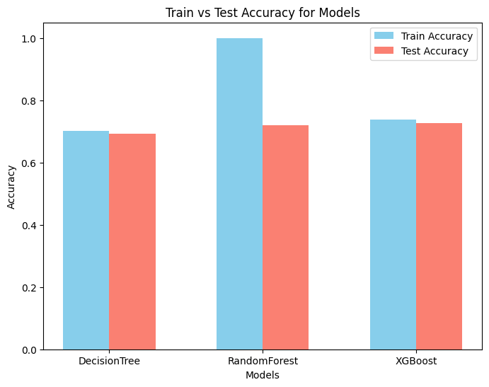

# [SKN09-ML-4Team]
✅ SKN AI FAMILY CAMP 9기<br>
✅ 개발 기간: 2025.01.25 - 2025.02.02

<br>


# 📍 팀 소개
### 👩‍👧‍👦팀명: 자비스(JOBIS)<br>

### 👩‍💻팀원
 
| 김우중👨‍💻 | 임수연👩‍💻 | 조민훈👨‍💻 |
|--|--|--|
|<a href="https://github.com/kwj9942">@kwj9942</a>|<a href="https://github.com/ohback">@ohback</a>|<a href="https://github.com/alche22">@alche22</a>|
<br>

# 📍 프로젝트 개요
### [ 주제 ]<br>
취업훈련을 받은 대졸자들의 취업 현황 예측

### [ 배경 ]<br>
청년들의 취업률이 지속적으로 감소하는 추세에, 취업에 도움되는 정보를 제공하기 위하여 노동패널의 설문조사 응답을 분석하고 머신러닝을 활용하여 취업 가능성을 예측함으로써 효과적인 취업 지원 전략을 수립하기 위한 프로그램을 제작


<br>

</br>

# 📍 데이터셋 개요 & 데이터 시각화
### [ 데이터셋 개요 ]<br>
학교에서 노동시장으로의 학교 (전공)별 이행현황 분석과 원활한 이행을 지원하기 위한 다각적인 정책적 수요 증대를 위한 조사인 [대졸자직업이동경로조사(GOMS: Graduates Occupational Mobility Survey)] 4년치(2016-19년도) 데이터를 사용하였음<br>
출처: [https://www.kli.re.kr/klips](https://www.kli.re.kr/klips)
<br>
</br>

### [ 데이터 시각화 ]<br>
- Heatmap<br>


<br>
</br>

- Barplot<br>


<br>
</br>

- Boxplot<br>


<br>
</br>

# 📍 데이터 전처리
1) 18년도의 자격증 점수 관련 응답에만 문자와 숫자가 혼합되어 있어, 다른 연도와 통일 시키기 위해 문자를 삭제하고 모든 데이터의 결측값은 0으로 채워주었음
```python
# 토익 점수 없으면 0, 18년도 문자형 변수 변경
use_data['i033'] = use_data['i033'].fillna(0)
use_data['i033'] = use_data['i033'].apply(lambda x: int(str(x)[2:-1]) if str(x)[0:1] == 'b' else int(x))
```
<br>

2) 범주형 데이터는 설문조사지의 응답과 비교하여 유, 무로 간소화
```python
# 군 복무 경험 있으면 1, 없으면 0
use_data['p045'] = use_data['p045'].replace({val:0 for val in [-1,1,6,7]})
use_data['p045'] = use_data['p045'].apply(lambda x: 0 if x == 0 else 1)
use_data['p045'] = use_data['p045'].fillna(0)
```
<br>

3) 고용여부와 상관관계를 보이지 않는 b코드 제거


<br>

4) 유의미한 변수의 상관관계
- 직업/교육 훈련 종료 여부: 훈련을 끝까지 마친 응답자의 취업률이 상대적으로 높음


<br>

- 고등학교 계열: 3번(외고, 과학고, 국제고), 8번(특성화고)의 취업률이 높고,<br>
4번(예술고, 체육고), 10번(방통고, 대안학교 등)의 취업률이 낮음


<br>

- 전공: 의약, 공학, 사회계열 순으로 높고 예체능이 가장 낮음


<br>
</br>

# 📍 머신 러닝 (Machine Learning)
### [ 분석 순서 ]


### 1) 기본모델<br>
기본값으로 DecisionTree, RandomForest, XGBoost 3가지 모델을 시도한 결과




<br>

### 2) 평가<br>
위 세가지 모델 모두 0.7 정도의 정확도를 보여 **혼동행렬** 확인 결과, 전부 1로 분류 되었음 <br>
70% 대의 성능이 나오는 이유는 전부 y=1(취직함)으로 예측하기 때문으로 y값의 비율 차이로 발생 추정<br>

<br>

### 3) 개선<br>
타겟 데이터의 갯수 균형을 잡기 위하여 **오버샘플링** 시도<br>
SMOTE는 가장 가까운 값 사이에 직선을 만들고 그  안에서 새로운 값을 뽑는 방식으로 범주형 변수에 맞지 않아서 RandomOverSampler 사용함

```python
smt = SMOTE(random_state=42)
X_new, y_new = smt.fit_resample(X, y)
ros = RandomOverSampler(random_state=42)
X_res, y_res = ros.fit_resample(X, y)

# Counter({1: 10732, 0: 4853})
# Counter({0: 10732, 1: 10732})
# Counter({0: 10732, 1: 10732})
```
<br>

### 4) 최적화<br>
최적의 하이퍼 파라미터를 선택하여 높은 정확도의 모델을 만들기 위해 **그리드 서치** 사용<br>

```python
dt_clf = DecisionTreeClassifier(max_depth=25, random_state=0)
rf_clf = RandomForestClassifier(max_depth=34, n_estimators=550, random_state=0)
xgb_clf = XGBClassifier(learning_rate=0.05, max_depth=23, n_estimators=800, random_state=0)
lgbm_clf = LGBMClassifier(n_estimators=1500, learning_rate=0.1, random_state=0)
```
<br>
<br/>

# 📊 실제 예측 결과
DecisionTree, RandomForest, XGBoost, LightGBM 4가지 모델의 최적 파라미터를 설정하고<br>
5-foldvalidation을 이용하여 정확도, 정밀도, 재현율을 비교 하였을 때 RandomForest가 가장 우수한 성능을 보임


```python
DecisionTree 정확도: 0.6995951709679751
DecisionTree 정밀도: 0.7512877969279211
DecisionTree 재현율: 0.6994063543009145

RandomForest 정확도: 0.7757249550569872
RandomForest 정밀도: 0.7861506110046139
RandomForest 재현율: 0.88166643588162

XGBoost 정확도: 0.756156308119006
XGBoost 정밀도: 0.7844645569174908
XGBoost 재현율: 0.8393627120527526

LightGBM 정확도: 0.7478630766963016
LightGBM 정밀도: 0.7819028697159789
LightGBM 재현율: 0.8310703810470927
```

<br>

<br/>

# 🎯 프로젝트 기대 효과
- 청년 실업 문제 해결을 위한 데이터 기반 인사이트 제공
- 구직자 맞춤형 취업 전략 수립 지원
- 청년층의 취업률 향상 기여
<br>

<br/>
