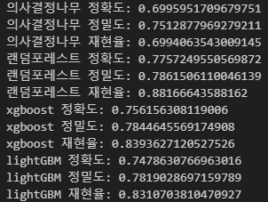

# [SKN09-ML-4Team]
✅ SKN AI FAMILY CAMP 9기<br>
✅ 개발 기간: 2025.01.25 - 2025.02.02

<br>


# 📍 팀 소개
### 👩‍👧‍👦팀명: 자비스(JOBIS)<br>

### 👩‍💻팀원
 
| 김우중👨‍💻 | 임수연👩‍💻 | 조민훈👨‍💻 |
|--|--|--|
|<a href="https://github.com/kwj9942">@kwj9942</a>|<a href="https://github.com/ohback">@ohback</a>|<a href="https://github.com/alche22">@alche22</a>|
<br>

# 📍 프로젝트 개요
### [ 주제 ]<br>
취업훈련을 받은 대졸자들의 취업 현황 예측

### [ 배경 ]<br>
청년들의 취업률이 지속적으로 감소되는 추세에, 취업에 도움되는 정보를 제공하기 위하여 노동패널의 설문조사 응답을 분석하고 머신러닝을 활용하여 취업 가능성을 예측함으로써, 효과적인 취업 지원 전략을 수립하기 위한 프로그램을 제작


<br>

</br>

# 📍 데이터셋 개요 & 데이터 시각화
### [ 데이터셋 개요 ]<br>
학교에서 노동시장으로의 학교 (전공)별 이행현황 분석과 원활한 이행을 지원하기 위한 다각적인 정책적 수요 증대를 위한 조사인 [대졸자직업이동경로조사(GOMS: Graduates Occupational Mobility Survey)] 4년치(2016-19년도) 데이터를 사용하였음<br>
출처: [https://www.kli.re.kr/klips](https://www.kli.re.kr/klips)
<br>
</br>

### [ 데이터 시각화 ]<br>
- Heatmap<br>


<br>
</br>

- Boxplot<br>


<br>

</br>

# 📍 데이터 전처리
1) 숫자형 데이터는 결측값을 0, "모름" 을 최빈값으로 채움
```python
# 부모님의 자산규모 nan -> 0 and 모름 -> 평균값 3.01로 대체
use_data['p036'].replace(-1, 3.01, inplace=True)
use_data['p036'] = use_data['p036'].fillna(0)
```
<br>

2) 범주형 데이터는 설문조사지의 응답과 비교하여 유, 무로 간소화
```python
# 군 복무 경험 있으면 1, 없으면 0
use_data['p045'] = use_data['p045'].replace({val:0 for val in [-1,1,6,7]})
use_data['p045'] = use_data['p045'].apply(lambda x: 0 if x == 0 else 1)
use_data['p045'] = use_data['p045'].fillna(0)
```
<br>

3) 고용여부와 상관관계를 보이지 않는 b코드 제거


<br>

4) 유의미한 변수 확인 -> 그래프(+설명) 추가 해야함


<br>

<br/>

# 📍 머신 러닝 (Machine Learning) -> 과정이 좀 더 상세했으면
### [ 분석 순서 ]


1) DecisionTree, RandomForest, XGBoost, LightGMB 4가지 모델 시도
<br>

2) 위 모델 모두 약 0.7 정확도를 보여 혼동행렬 확인 결과, 전부 1로 분류됨을 확인<br>


<br>

3) 오버샘플링을 통한 타겟 데이터의 갯수 균형 잡기
```python
smt = SMOTE(random_state=42)
X_new, y_new = smt.fit_resample(X, y)
ros = RandomOverSampler(random_state=42)
X_res, y_res = ros.fit_resample(X, y)

# Counter({1: 10732, 0: 4853})
# Counter({0: 10732, 1: 10732})
# Counter({0: 10732, 1: 10732})
```
<br>

4) 그리드 서치를 통한 모델의 최적 파라미터 탐색
```python
dt_clf = DecisionTreeClassifier(max_depth=25, random_state=0)
rf_clf = RandomForestClassifier(max_depth=34, n_estimators=550, random_state=0)
xgb_clf = XGBClassifier(learning_rate=0.05, max_depth=23, n_estimators=800, random_state=0)
lgbm_clf = LGBMClassifier(n_estimators=1500, learning_rate=0.1, random_state=0)
```
<br>

5) Foldvalidation 결과로 모델 선정 ->  RandomForest 모델이 가장 우수함



<br>

<br/>

# 📊 실제 예측 결과 -> 예측 결과 필요

<br>

<br/>

# 🎯 프로젝트 기대 효과
- 청년 실업 문제 해결을 위한 데이터 기반 인사이트 제공
- 구직자 맞춤형 취업 전략 수립 지원
- 청년층의 취업률 향상 기여
<br>

<br/>

# 📌 한줄회고 -> 필요할까요?
김우중👨‍💻 : <br>
임수연👩‍💻 : <br>
조민훈🧑‍💻 : <br>
